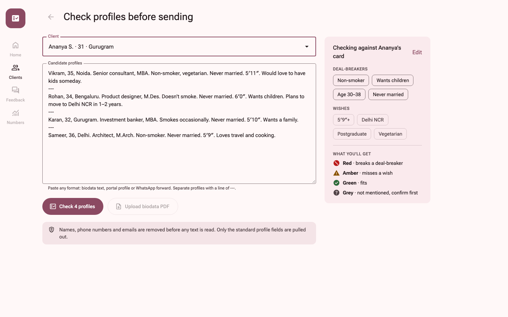
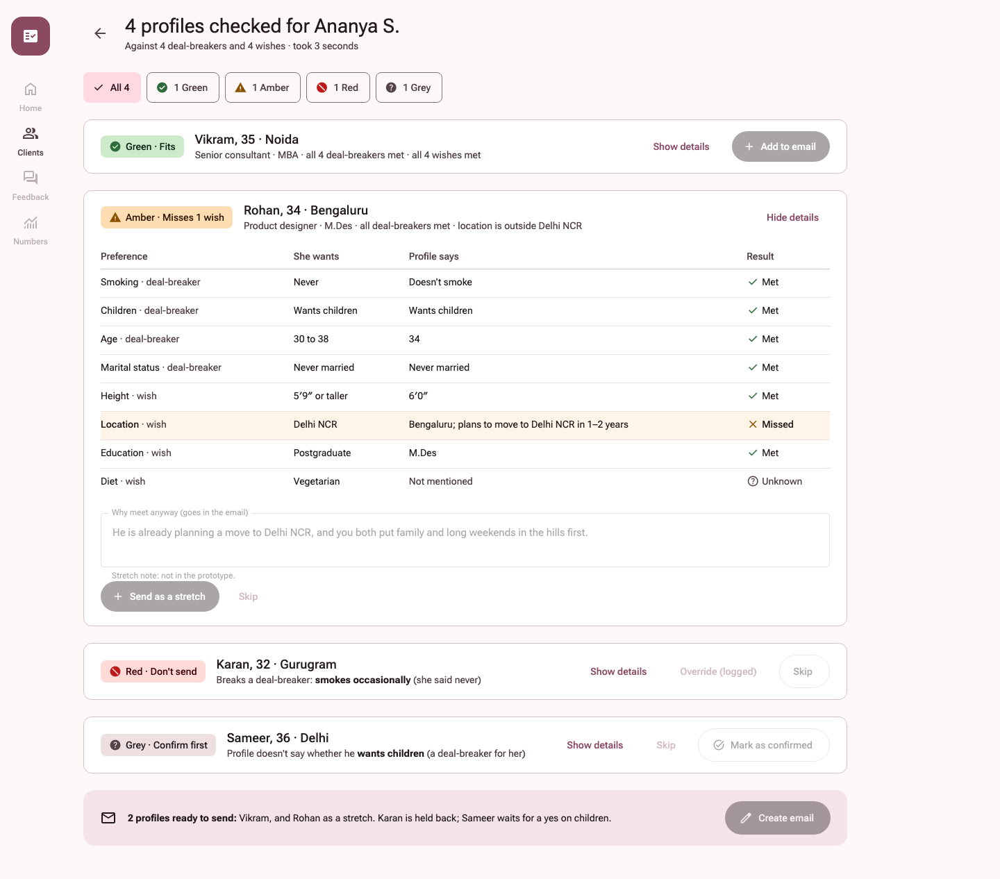
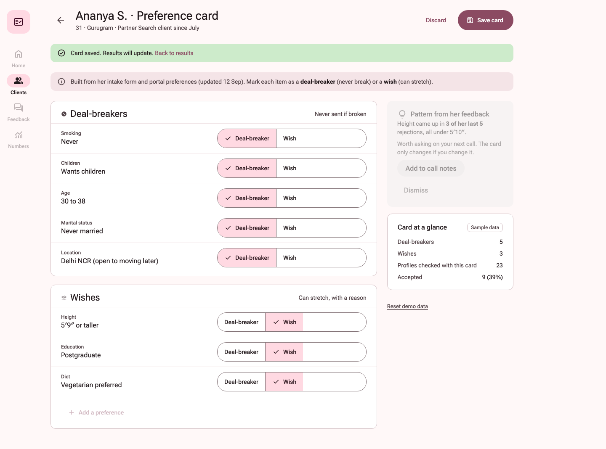
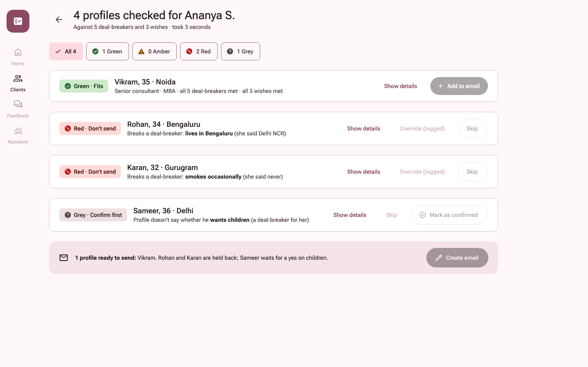
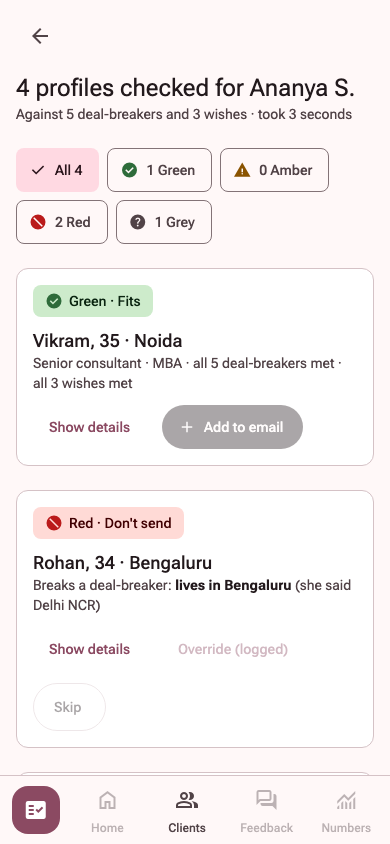

# Pre-Send Check

Matchmakers at The Date Crew paste candidate profiles and see which ones fit a client's preference card before anything is sent. The demo matchmaker is Kavya, with sample clients Ananya, Ishita, and Dev.

Live app: https://tdc-pre-send-check.vercel.app

## Screenshots











## AI reads, rules decide

- Gemini reads each profile and only fills in standard fields such as age, city, and smoking. If a fact is not stated, the field stays empty.
- Plain rules in the browser compare those fields with the saved card. The model never chooses the verdict.
- If Gemini fails, Groq can try once. With no Groq key, that fallback is skipped.

## Verdicts

- **Green** — fits. The deal-breakers are met and no wish is missed.
- **Amber** — every deal-breaker is met, but a wish is missed.
- **Red** — a deal-breaker is broken.
- **Grey** — a deal-breaker field was not mentioned. An unknown wish does not change the colour.

## Run locally

```bash
npm install
cp .env.example .env.local
```

Put `GOOGLE_GENERATIVE_AI_API_KEY` in `.env.local`. Leave `GROQ_API_KEY` blank to skip the fallback. The default model is `gemini-3.5-flash` (`gemini-2.5-flash` is closed to new API keys).

```bash
npm run dev
npm test
```

Open http://localhost:3000. It redirects to the check page.

## Stack

Next.js 16 (App Router, TypeScript), React 19, plain CSS, the Vercel AI SDK (`ai`, `@ai-sdk/google`, `@ai-sdk/groq`), Zod, and Vitest. There is no database. The last check stays in memory. Saved card types are also kept in `localStorage`.

## Mocked, and not in this prototype

Clients, the pasted samples, and Ananya's "23 checked / 9 accepted" glance are sample data. Home, Feedback, and Numbers are greyed out. Uploading a biodata PDF, adding a preference, the feedback-pattern card, and the actions after a verdict (email, stretch send, override, confirm) are shown and disabled.
